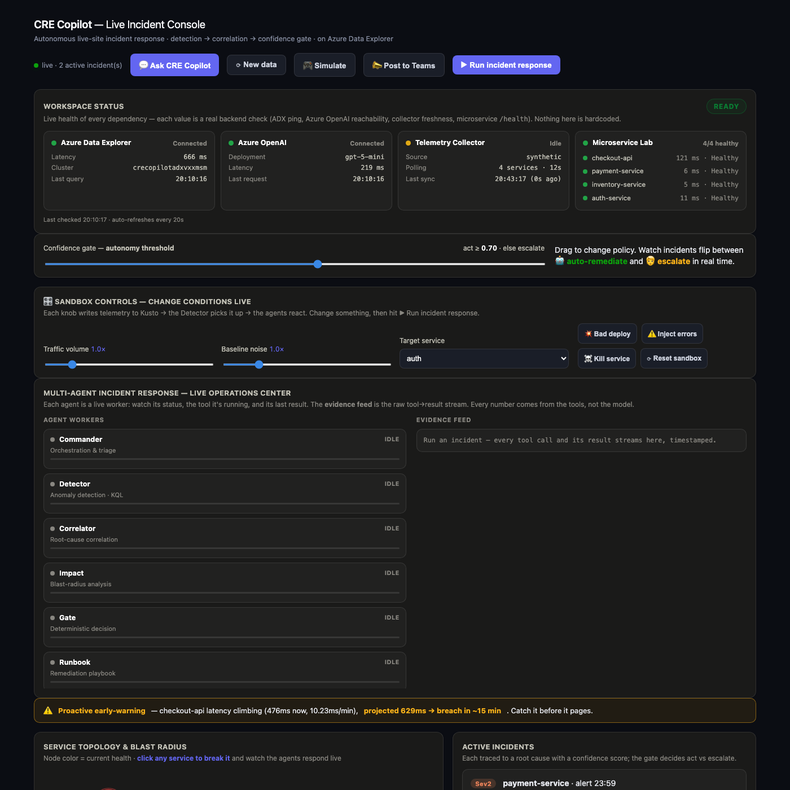
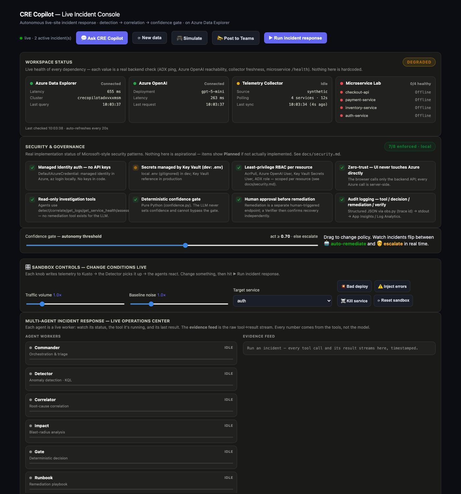
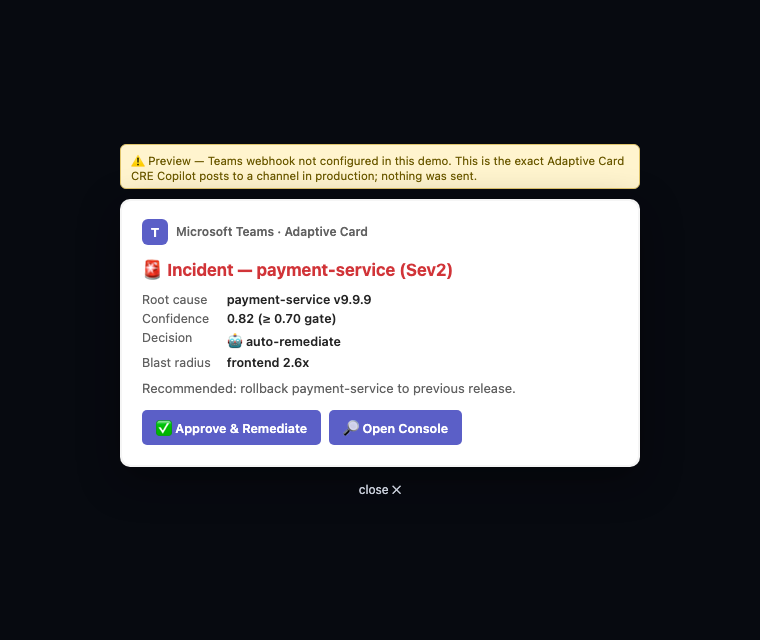

# CRE Copilot

**AI-powered multi-agent incident response simulator.**

A live-site incident-response system on Azure. A team of AI agents detects an anomaly,
investigates **real evidence** (health, logs, metrics, deploys, dependency graph), correlates
it to a root cause with a **confidence score**, and a **deterministic confidence gate** decides
whether to **act autonomously** or **escalate to a human** — with the human approving before any
remediation, and a **Verifier agent** independently confirming recovery before the incident closes.

Built to demonstrate SRE / service-engineering + multi-agent AI on the Microsoft / Azure stack.

> **Demo workspace — honest framing:** telemetry is synthetic or from a local microservice lab (not a
> production estate), and remediation is a simulated recovery. Everything *through the decision* —
> detection, correlation, confidence, the deterministic gate, human approval, and verification — is
> real and runs on live Azure services.

**Deployed live on Azure Container Apps** · keyless (managed identity) · [architecture](docs/architecture.md) · [security](docs/security.md)



<!-- Add a ~15s demo GIF here once recorded (incident → investigate → approve → heal → verify):
      -->

---

## The idea
Live-site incidents have a slow middle: an alert fires, then a human spends 30–90 minutes on
*"what changed?"* and *"is it safe to act?"*. CRE Copilot collapses that middle — and shows its
work like an operations center, so you watch each agent investigate rather than trusting a black box.

**Headline result:** autonomous resolution cuts **MTTR from 81 min → 13 min (6×)** by acting in
seconds on high-confidence cases and reserving humans for the ambiguous ones.

---

## How it works

```
                      ┌──────────────── Azure Data Explorer (Kusto) ◀── collector ◀── microservices
                      │                        ▲                                       (real /health,
   Commander ─ plans the investigation         │ KQL: anomaly / correlate / impact      /metrics, /logs)
   Detector  ─ series_decompose_anomalies  ── which services are anomalous?
   Correlator─ proximity × anomaly × topology + logs + deploys ── root cause + CONFIDENCE
   Impact    ─ dependency-graph walk ── blast radius
        │
        ▼
   CONFIDENCE GATE  ──▶  confidence ≥ 0.70 ?  🤖 auto-remediate  :  🧑 escalate to human
        │                         (deterministic — the LLM never sets its own confidence)
        ▼
   Human approves ─▶ Runbook agent applies fix ─▶ real POST /recover ─▶
   Verifier agent  ─ independently confirms recovery from real /health + logs ─▶ close
        │
        ▼
   Postmortem agent ─ writes the review, authors a runbook if the failure was novel
```

The agents are **hosted Azure OpenAI Assistants** that call KQL functions and read-only investigation
tools; the **gate is pure Python** (`0.40·proximity + 0.40·anomaly + 0.20·dependency`) so autonomy is
deterministic and testable, never model-invented. Everything authenticates via **Managed Identity**
(cloud) / `az login` (local) — no keys in code.

---

## What makes it more than a dashboard

- **Real microservice lab** — `checkout-api`, `payment-service`, `inventory-service`, `auth-service`
  are actual FastAPI services with dependencies, failure injection, and real `/health` cascades, so
  blast radius and recovery are **measured, not mocked**.
- **Operations-center console** — agents render as **live workers** (status · current tool · last
  result), beside a timestamped **evidence feed** of every tool call → result. You see the engineering.
- **Human-in-the-loop cure loop** — approve → real `/recover` → topology heals RED→GREEN → Verifier
  confirms → postmortem.
- **Deterministic gate + counterfactual** — each incident shows *"would flip to escalate if the anomaly
  ratio were < N×"*, derived from the same formula.
- **Live workspace health** — `/api/workspace/status` probes ADX, Azure OpenAI, the collector, and every
  service in real time (no hardcoded values).
- **Microsoft Teams** — posts a real Adaptive Card for the incident, with an Approve action that triggers
  remediation. Honest preview mode when no webhook is configured.
- **Dynamic mode** — `?mode=dynamic` lets a single orchestrator agent pick its own read-only tools
  step-by-step (guardrailed: read-only, step cap, deterministic gate, human approval).

---

## Tech stack (Azure-native)
Azure Data Explorer (Kusto) · Azure OpenAI (Assistants API, `gpt-5-mini`) · Azure Container Apps ·
Azure Container Registry · FastAPI · Managed Identity + Key Vault + RBAC · Bicep (IaC) · Microsoft Teams.

---

## Run it locally
```bash
source demo/env.sh                       # env + local secrets (gitignored)

./services/run_services.sh               # start the 4 microservices
TELEMETRY_SOURCE=services \
  ./data/.venv/bin/python collector/collector.py &   # (optional) real telemetry → ADX
./demo/console.sh                        # console at http://localhost:8000
```
Break a service from the topology (or the sandbox controls), hit **Run incident response**, watch the
agents investigate, then **Approve** to heal.

## Deploy to Azure (Container Apps)
```bash
./infra/deploy_containerapps.sh          # builds 3 images, provisions env + 6 apps, keyless
./infra/teardown_containerapps.sh        # tear down to stop billing
```
Backend + 4 microservices + always-on collector on Container Apps, reusing the existing ADX + Azure
OpenAI, all via one managed identity (ACR pull + ADX viewer + Azure OpenAI user).

---

## Repo map
| Area | Where |
|---|---|
| Hosted agents + tools + gate wiring | `functions/agents/assistants.py` |
| Deterministic confidence gate (+ tests) | `functions/shared/confidence.py`, `functions/tests/` |
| KQL: detector / correlator / impact / trend | `data/kql/*.kql` |
| Microservice lab | `services/` |
| Telemetry collector | `collector/` |
| Console (backend + UI) | `app/server.py`, `app/index.html` |
| Infra (IaC) | `infra/main.bicep`, `infra/containerapps.bicep` |
| Security posture (live) + audit | `/api/security/status`, `functions/shared/obs.py`, `docs/security.md` |
| Evaluation harness (precision/recall) | `eval/` |

Every dependency's health and the security posture are reported live (no hardcoded values):

<p align="center"></p>

## Honest notes
- This is a **demo workspace**: telemetry is synthetic or from the local microservice lab, not a real
  production estate. No production systems are connected.
- The **gate is deterministic** by design — agents investigate and explain; the act-vs-escalate line is
  pure code, and a human approves before any remediation.

<p align="center"></p>
