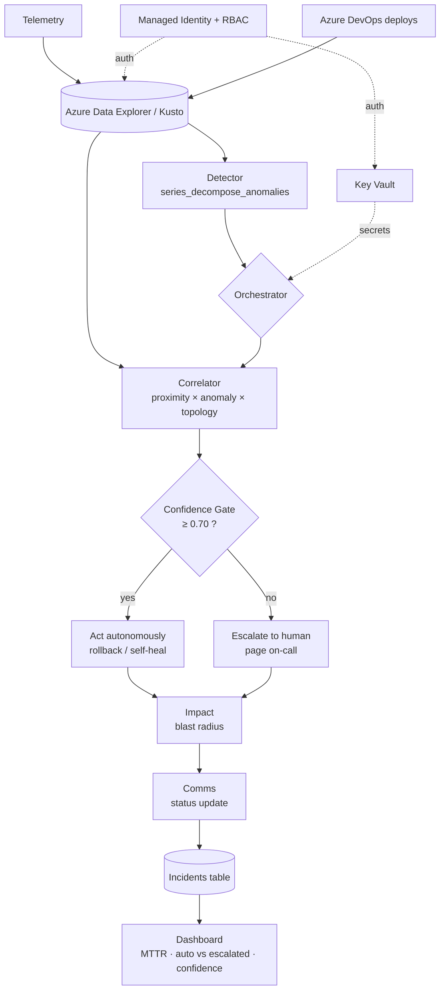

# CRE Copilot — Architecture

## Flow


## Components
- **Azure Data Explorer (Kusto)** — stores telemetry, deploys, alerts, incidents, topology. All agent
  logic lives here as stored KQL functions (`Detect`, `Correlate`, `ImpactAssessment`).
- **Detector** — `series_decompose_anomalies` with the baseline learned from clean history
  (`test_points`) so a large sustained spike can't mask itself. No hand-set thresholds.
- **Correlator** — ranks root-cause deploys by `0.45·proximity + 0.35·anomaly + 0.20·dependency`.
  Beats the naive "blame the newest deploy" by using anomaly magnitude + service topology.
- **Confidence gate** (`functions/shared/confidence.py`) — pure, testable act-vs-escalate decision.
- **Impact / Comms** — downstream blast radius (graph walk) + generated status update.
- **Orchestrator** (`functions/orchestrate.py`) — chains the agents and the gate; writes outcomes.
  Deployable to Azure Functions (Bicep `deployFunctions` flag) or run locally against live ADX.
- **Security** — Key Vault + system-assigned Managed Identity + RBAC, defined in `infra/main.bicep`.
  No secrets in code; least-privilege role assignments.

## Design decisions
- **Logic in KQL, not app code** — scales inside the cluster where the data already is; also lets
  Copilot Studio call the same functions via the ADX connector.
- **Gate in Python, not the GUI** — the act-vs-escalate rule is versioned and unit-tested, not buried
  in a Copilot Studio prompt.
- **Feature-flagged Function tier** — new-subscription App Service quota is 0; the data plane deploys
  now, the compute tier flips on with one flag when quota is granted.
```
