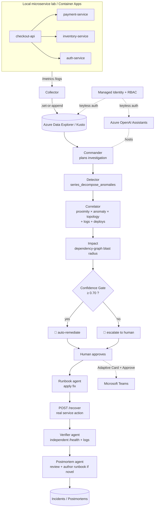

# CRE Copilot — Architecture

## Investigation flow


## Components
- **Azure Data Explorer (Kusto)** — stores telemetry, deploys, alerts, logs, incidents, topology.
  Detection/correlation/impact live as stored KQL functions (`Detect`, `Correlate`,
  `ImpactAssessment`, `DetectTrend`).
- **Microservice lab** (`services/`) — 4 real FastAPI services with dependencies, failure injection,
  `/recover`, and real `/health` cascades → measured blast radius and recovery.
- **Collector** (`collector/`) — polls the services' `/metrics` + `/logs` and ingests real telemetry
  into ADX (feature-flagged: `TELEMETRY_SOURCE=services`, else the synthetic generator is the source).
- **Agents** (`functions/agents/assistants.py`) — hosted **Azure OpenAI Assistants**
  (Commander, Correlator, Impact, Gate, Runbook, Verifier, Postmortem, + a Copilot). They call the KQL
  functions and read-only evidence tools (`get_service_health`, `get_logs`); a dynamic mode lets one
  orchestrator pick tools step-by-step under guardrails.
- **Detector** — `series_decompose_anomalies` with the baseline learned from clean history
  (`test_points`) so a large sustained spike can't mask itself. No hand-set thresholds.
- **Correlator** — ranks root cause by `0.40·proximity + 0.40·anomaly + 0.20·dependency`, path-aware so
  concurrent incidents don't cross-blame; returns a counterfactual (`flipAnomalyRatio`).
- **Confidence gate** (`functions/shared/confidence.py`) — pure, unit-tested act-vs-escalate decision.
  The LLM never sets its own confidence.
- **Verifier** — after remediation, independently confirms recovery from real `/health` + logs before
  the incident closes.
- **Console** (`app/`) — FastAPI backend + single-page operations center (agents as live workers +
  evidence feed, topology/blast radius, human-in-the-loop cure loop, live workspace status, Teams).
- **Security** — Key Vault + Managed Identity + RBAC (`infra/main.bicep`, `infra/containerapps.bicep`).
  No secrets in code; least-privilege role assignments; keyless local↔cloud via DefaultAzureCredential.

## Design decisions
- **Deterministic gate, investigative agents** — agents gather evidence and explain; the autonomy line
  is versioned Python, not a prompt. Safety and auditability over cleverness.
- **Evidence, not numbers in a table** — confidence is computed from measured signals (real health,
  logs, deploys, topology), so the same formula drives both the demo and the explanation.
- **Additive evolution** — synthetic telemetry, real microservices, and cloud deployment are all
  feature-flagged; local dev never breaks.
- **Keyless everywhere** — Managed Identity in the cloud, `az login` locally; the same code path.
```
